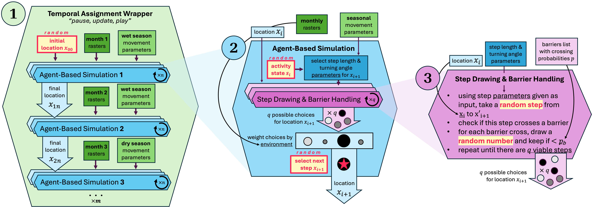

```{r setup, include=FALSE}
pacman::p_load(knitr, tidyverse, grid, gridExtra, reshape2, patchwork)
opts_chunk$set(echo = TRUE)
```

The model description follows the ODD (Overview, Design concepts, Details) protocol for describing individual- and agent-based models ([Grimm et al. 2006](https://www.sciencedirect.com/science/article/pii/S0304380006002043?casa_token=9nqjSgQXAoIAAAAA:4haL1kOsD2J0kLIgXOO4KvNbKnxiZfiQmpl6JF3hCKVzXTvvnTALv6u2JsssaiBweUhDQ3GH4w)), as updated by [Grimm et al. (2020)](https://ui.adsabs.harvard.edu/abs/2020EcMod.42809105G/abstract).

- [GitHub page for the agent-based modeling package `abmAME`](https://github.com/margaret-swift/abmAME).
- [GitHub page for the savanna elephant implementation `kaza-ele`](https://github.com/margaret-swift/kaza-ele).

# Purpose and Patterns
## Purpose
The **proximate purpose** of this model is to accurately predict changes in African savanna elephant (*Loxodonta africana*) movement patterns after the decommissioning (i.e., partial or full removal) of veterinary fences. Veterinary fences, built to mitigate livestock disease risk, heavily restrict wildlife movements in southern Africa; the **ultimate purpose** of this work is to facilitate policymakers’ decisions to decommission fences by providing insight on savanna elephant movement changes pre- and post-decommissioning. 

## Patterns
We aim to replicate four **patterns** seen in location data from savanna elephants fitted with GPS-enabled collars, 42 in Namibia and XX in Botswana. These patterns can be divided into two **spatial patterns** and two **temporal patterns**. These patterns are represented in Figure Xa and b, respectively. **TBD: These figures have yet to be made!**

### Spatial Patterns

<ol>
<li> **Channeling along linear features.** There are several linear features included on the southern African savanna landscape. Savanna elephant often channel their movement along veterinary fences and along dry riverbeds, likely due to searching for crossing points in the former and an increased ease of movement for the latter. 
</li>
<li> **Differential permeability of linear features.** Linear boundaries may be crossed, but those crossing rates depend on (i) the type of linear feature, and (ii) the sex of the elephant (bull vs. cow). In general, elephant are most likely to cross rivers and least likely to cross veterinary fences. In addition, while bull elephants (males) often break through fences to continue in their direction of travel, cows (females) heavily avoid crossing fences. This is likely because even downed fences often still have steel cables stretched across the opening, and the juveniles and calves traveling with the GPS-collared cows cannot cross these cables. Crossing rates for linear features by feature type and elephant sex are given in Figure 1.
</li>
</ol>


```{r, fig.cap='**Figure 1. Linear feature crossing rates figure and table.** (left) A chart of crossing rates for three barrier types for males and females. (right) Table elements are the proportion (%) of time that a barrier was crossed when an elephant came within 1km of that barrier. Rates are given by feature type and elephant sex, with values adapted from [Naidoo et al 2022](https://www.frontiersin.org/articles/10.3389/fcosc.2022.788133/full).', echo = F, fig.height = 3, fig.align='center'}
crossing.rates <- data.frame(	River=c(10.1, 14.5),	
                              Road=c(15.3, 25.8),
                              Fence=c(0, 3.5)) * 0.01
rownames(crossing.rates) <- c('female', 'male')

# Bar chart
colors<- c('black', 'gray')
myfig <- crossing.rates %>% 
  rownames_to_column(var="sex") %>% 
  melt(id='sex') %>% 
  ggplot(mapping=aes(y=value, x=variable, fill=sex)) + 
    geom_bar(stat="identity", position="dodge") + 
    theme(text=element_text(size=14)) + 
    scale_fill_manual(values=colors) + 
    xlab('barrier type') + ylab('probability \nof crossing')

# table
tt3 <- ttheme_minimal(
  core=list(bg_params = list(fill=colors),
            fg_params=list(col=c('white', 'black'))))
mytab <- gridExtra::tableGrob(crossing.rates, theme=tt3)

# put it together
( myfig + mytab ) + plot_layout(widths=c(1, 2))
```

### Temporal Patterns

<ol start="C">
<li>**Wet season movement increases.** During the wet season, elephant forage on flush vegetation, traveling farther in a single day than during the dry season, when they are restricted to areas near rivers and waterholes.
</li>
<li> **Daily drinking.** Elephant must drink daily, especially during the dry season when there is little water on the landscape or in vegetation. Because of this behavior, water sources pose a greater attraction in the dry season than the wet season, as elephant return daily to rivers and established waterholes.
</li>
</ol>


# Entities, state variables, and scales
## Entities
**Model entities** are _individual agents_ (African savanna elephant *L. africana*); _linear features_ (rivers, roads, fences); _point features_ (natural waterholes and artificial waterholes); and _raster features_ (burn time, distance from human settlement, habitat type, vegetation index, distance from water). Physical characteristics of the agents, linear and point features are static in time, but raster features may change temporally.

``` {r echo=FALSE, results="asis"}
entities <- read.csv('tables/entities.csv')
kable(entities, caption="**Table 2. Model entities.** Description")
```

## State variables

``` {r echo=FALSE, results="asis"}
entities <- read.csv('tables/attributes.csv')
kable(entities, caption="**Table 3. Entity attributes** Characteristics of individual entities in the model.")
```

## Scales and extents
Spatial and temporal scales are given in Table 3. The spatial extent of our model is the Kavango-Zambezi Transfrontier Conservation Area in central southern Africa. The temporal extent of our model is five years.

# Process Overview and Scheduling
The project is broken into three **processes**, defined below from broad to narrow scope. An (1) outer **temporal assignment wrapper** (TAW) defines environmental raster data for each month m of the simulation and inputs these data into an (2) **agent-based simulation** (ABS) to simulate each hour n of elephant movement given static spatial and agent parameters. Within this ABS, a (3) **step drawing and barrier handling** (SDBH) process is used to determine barrier crossing of potential agent movements and accept/reject based on barrier permeability.
The separation of temporal and spatial patterns into the outer TAW and inner ABS processes allows the temporal structure of the landscape to be updated monthly (especially vegetation changes due to rainfall patterns), while keeping each $ABS_{m+1}$ dependent only on the final time step of the previous $ABS_{m}$. In future work, we hope to update this communication between TAW and ABS to include a system memory of previously visited locations as an input for each $ABS_{m}$.

## Process 1: Temporal Assignment Wrapper 
The TAW is the code governing the long-term trends of landscape change. Given the overall simulation time period as an input, the program compiles a list of spatial data for each of m months in the simulation. The initial position x0 of the agent is randomly selected on the landscape and fed into the ABS process (outlined below) for $n$ iterations corresponding to the number of hours in the current month $m$. Then, the output of $ABS_{m}$ (simulated hourly movement data for the month $m$) is saved and the spatial raster data updated to the new month m+1. The final step of $ABS_{m}$, $x_m$, is used as the new $x_0$ for $ABS_{m+1}$. The TAW continues in this pattern until the entire simulation is run. 

## Process 2: Agent-Based Simulation
The ABS is the core functionality of this project, written in C++. For each iteration i of n total iterations, the program begins with a current location $x_0$ and randomly selects a behavioral state $s_i$. If the behavioral state has been updated ($s_i\neq s_{i+1}$), the agent selects a new long-term destination. The program then selects parameters to define the Gamma and von Mises distributions for step length and turning angle, respectively, based on the chosen behavioral state $s_i$.

The program then randomly draws pairs of turning angles and step lengths from these distributions (based on $s_i$) using the SDBH process (outlined below) until the program reaches a user-supplied q number of viable pairs, or until 5000 attempts are made. Once all q pairs have been drawn (detailed in the sub-process below), the model then assigns a weight ($w_j$) to each pair based on the environmental raster supplied, the distance to the selected long-term destination, and distance from any supplied avoidance points. Finally, step $x_i$ is selected randomly given these weights, and the program is run again for iteration $i+1$, with location $x_0=x_i$ as the starting point.

## Process 3: Step Drawing and Barrier Handling
The SDBH is a sub-process used in the ABS to properly sample barrier crossings by agents based on each barrier's permeability, $p_b$, supplied by the user. This process is written in C++.

For each line $j$ between the current location $x_i$ and a potential new location $x'_{i+1}$, the program checks whether line $j$ will cross any linear barrier. If there is a potential crossing, for each barrier $b$ (of those potentially crossed), a random number $P_j$ is drawn and compared to the barrier’s inherent probability of crossing. If $P_j > p_b$, the new location $x'_{i+1}$ is rejected and a new one selected. This process continues until $q$ viable pairs are selected, or until 5000 attempts are made. 




# Basic principles 
**The next few sections are under construction!**

## Emergence
## Adaptation
## Objectives
## Learning
## Prediction
## Sensing
## Interaction
## Stochasticity
## Collectives
## Observation

# Initialization
# Input data
# Submodels